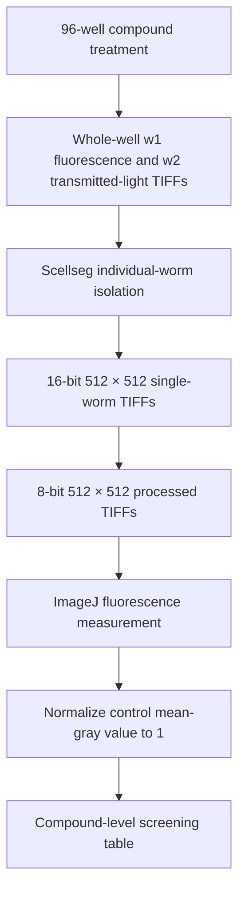
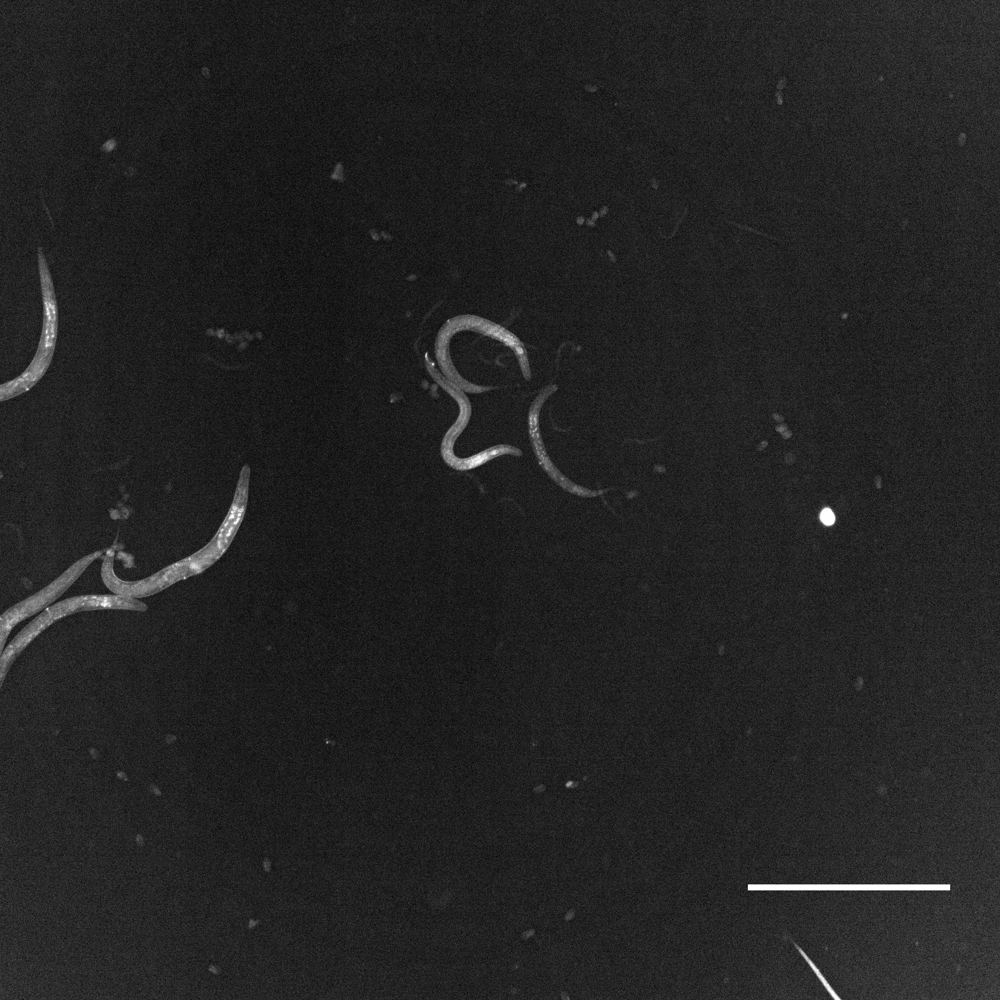
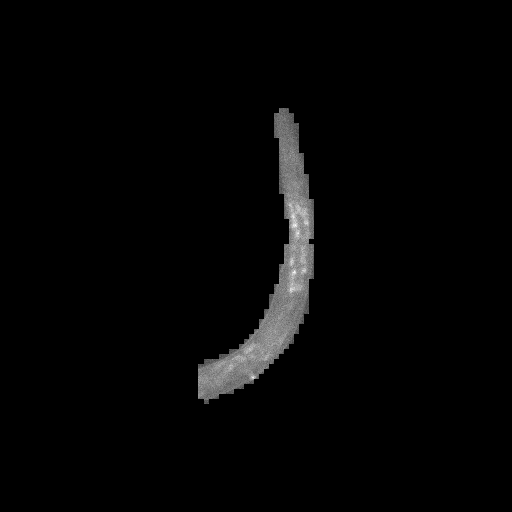

# COL-12 Screening Image Workflow

## Purpose and scope

This workflow describes the observable path from whole-well COL-12::GFP images
to individual-worm TIFFs and fluorescence measurements. It documents the
screening-image work package only. Exact Scellseg rerunning is not yet possible
because the project model weights, run parameters, segmentation masks, and
processing scripts are not present.

## Experimental input

| Property | Reported or observed value |
|---|---|
| Reporter | `Pcol-19-COL-12::GFP` |
| Library | 614 natural compounds |
| Concentration | 100 µM |
| Exposure | 12 h at 20 °C |
| Plate | Greiner 655090 black 96-well |
| Instrument | ImageXpress PICO |
| Objective | 4× |
| Raw channels | `w1` FITC/GFP; `w2` transmitted light |

## Workflow overview

## Observed processing stages

### 1. Whole-well acquisition

The archive contains 2,186 16-bit raw TIFFs. Most positions contain a paired
FITC/GFP and transmitted-light image. Twelve positions are missing one of the
two expected files and should be marked as partial observations.

### 2. Individual-worm isolation

The publication states that Scellseg was used to isolate individual worms from
whole-well images. The archive contains 4,718 16-bit single-worm TIFFs at
512 × 512 pixels in the two primary `input` groups. The current image release
does not contain the corresponding labelled masks, outlines, cell-pose fields,
model checkpoint, or run configuration.

### 3. 8-bit processing

All 4,718 TIFFs in the two primary 16-bit groups have an exact same-named file
in the corresponding 8-bit group. The archive also contains 2,309 additional
8-bit TIFFs in complement, missing-output, and additional-result directories.
Their exact parent-file and exclusion/replacement relationships remain
unresolved.

### Representative whole-well and single-worm result

The following images come from a directly mapped Plate 2, well B09 acquisition.
The metadata identifies this position as Oleanolic Acid. The left panel is the
whole-well `w1` fluorescence image, and the right panel is one associated 8-bit
single-worm output identified by the shared filename prefix and instance
number. Without the archived mask or outline, the individual crop cannot be
mapped visually to a specific worm in the whole-well display.

The whole-well PNG is for browser display only: the 1st and 99.85th intensity
percentiles of the 16-bit TIFF (39 and 124) were linearly mapped to 0–255. The
archived TIFF and quantitative pixel values are unchanged.

| Whole-well `w1` fluorescence | 8-bit single-worm output |
|---|---|
|  |  |

### 4. ImageJ measurement and normalization

The publication states that isolated-worm images were processed in ImageJ to
obtain fluorescence data and that the control mean-gray value was normalized
to 1. The current metadata workbook does not contain these measurements. The
supporting `final-plotting.xlsx` contains the compound-level and worm-level
analysis tables, but the exact ImageJ macro, background subtraction,
thresholding, exclusion logic, and normalization formula are not archived.

## Output inventory

| Output | Records |
|---|---:|
| Raw whole-well TIFFs | 2,186 |
| 16-bit single-worm TIFFs | 4,718 |
| 8-bit single-worm TIFFs | 7,027 |
| **Released screening TIFFs** | **13,931** |

## Quality control

- Review single-worm crops for merged worms, fragments, debris, edge
  truncation, and empty images.
- Preserve acquisition, plate, well, instance number, and processing-stage
  identifiers.
- Treat the 12 incomplete raw modality pairs explicitly as partial records.
- Do not infer an original L6000 well from a complement/re-array well label.
- Preserve 16-bit and 8-bit TIFFs as distinct processing stages.
- Keep the final biological measurement separate from image-level
  `contrast_std`.
- Record repeated, supplemented, replaced, and excluded wells in a future
  processing manifest.

## Reproducibility gaps

Exact rerunning requires:

- the Scellseg version and project model weights;
- fine-tuning data and settings, if applicable;
- selected channel, cell diameter, thresholds, device, and batch settings;
- the crop-generation procedure and mask-correction rules;
- the 16-to-8-bit conversion procedure;
- the ImageJ version, macro, measurement settings, and background correction;
- exclusion and replacement rules for failed or dead-worm wells; and
- code linking per-worm values to the normalized compound table.

These gaps should remain labelled as unknown until the original processing
records are recovered from the algorithm and experiment owners.
