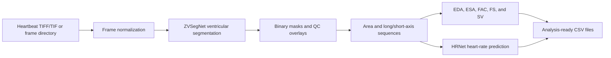
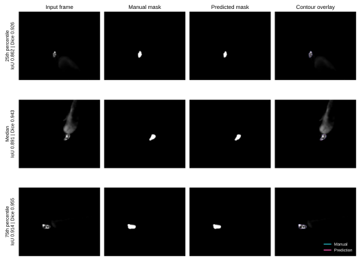
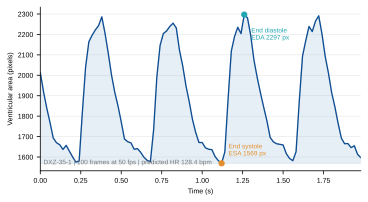
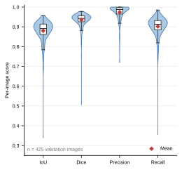
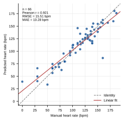

# DOX Zebrafish Cardiac Analysis Workflow

This workflow describes the reproducible image-analysis example distributed
with the Doxorubicin-Induced Heart Failure Dataset. It uses the project-trained
ZVSegNet and HRNet checkpoints to segment the fluorescent zebrafish ventricle,
derive ventricular geometry over time, calculate cardiac parameters, and
estimate heart rate.

The page follows the same practical structure as the accompanying APOC2
workflow: define the input, run the analysis, retain quality-control outputs,
summarize model performance, and provide analysis-ready tables and figures.

## Biological Question

The associated article uses a `Tg(cmlc2:eGFP)` zebrafish model to evaluate
doxorubicin-induced cardiac injury. Ventricular contraction is represented by
changes in ventricular area and long/short axes across a heartbeat recording.
The resulting readouts include end-diastolic area (EDA), end-systolic area
(ESA), fractional area change (FAC), fractional shortening (FS), stroke volume
(SV), and heart rate (HR).

This workflow demonstrates how these measurements are obtained from images. It
does not repeat the article's compound-screening analysis across the entire
archive.

## Input Data

Dataset root:

```text
Doxorubicin_Induced_Heart_Failure_Dataset/dox/
```

Typical input:

```text
<batch>/<recording>.tiff
```

Metadata file:

[`metadata/metadata.xlsx`](metadata/DOX_metadata.xlsx)

The metadata workbook contains one row per imaging file retained in the
curated database. A recording used for cardiac analysis is normally a
100-frame TIFF/TIF stack acquired at 50 frames per second. SIF files require
conversion or a compatible reader before they can enter the current pipeline.

## Method Summary

1. Select a heartbeat TIFF/TIF stack or a directory of extracted frames.
2. Normalize each frame independently and resize it to the ZVSegNet input size.
3. Segment the ventricular region with the bundled project-trained checkpoint.
4. Retain the largest connected component and save one binary mask per frame.
5. Measure ventricular area and minimum-rectangle long/short axes.
6. Identify the maximal-area end-diastolic frame and minimal-area
   end-systolic frame.
7. Calculate EDA, ESA, FAC, FS, and SV.
8. Predict heart rate from the first 100 ventricular-area measurements with
   HRNet.
9. Save CSV outputs, masks, validation metrics, and quality-control figures.

## Workflow Diagram



## Ventricular Segmentation

ZVSegNet is the project-trained ventricular segmentation model supplied with
the source materials. For each frame, the foreground probability is
thresholded, resized to the original image dimensions, reduced to the largest
connected component, and morphologically closed.

Outputs:

- one binary ventricular mask per frame;
- ventricular area and long/short-axis measurements;
- optional per-image IoU, Dice, precision, and recall when manual masks are
  available;
- representative contour overlays for visual quality control.

The comparison below shows cases near the 25th, 50th, and 75th percentiles of
the validation-set IoU distribution, rather than selecting only the
highest-scoring examples. Cyan indicates the manual contour and magenta the
prediction. The displayed input frames were converted to grayscale without
local contrast adjustment; masks were not altered for presentation. No scale
bar is added because spatial calibration was not supplied for these validation
frames.



## Cardiac Parameter Extraction

The end-diastolic frame is the frame with maximum predicted ventricular area;
the end-systolic frame is the frame with minimum predicted area. The tool then
uses the article-reported formulas:

```text
FAC = (EDA - ESA) / EDA × 100%
FS  = (EDa - ESa) / EDa × 100%
SV  = 4π/3 × (EDa × EDb² - ESa × ESb²)
```

`EDa` and `ESa` are the long axes at end diastole and end systole; `EDb` and
`ESb` are the corresponding short axes. If spatial calibration is absent, SV
is reported in `pixel^3` and should be used only for relative comparisons.

The example below is a verified 100-frame, 50-fps DOX recording. It illustrates
the time-resolved model output and the frames used to define EDA and ESA; it is
not a group-level treatment result.



## Model Validation

### Segmentation

The bundled ZVSegNet checkpoint was rerun on all 425 manually annotated
validation images. Mean IoU, Dice, precision, and recall were 0.8798, 0.9350,
0.9738, and 0.9018, respectively. The distributions below retain all
per-image values, including difficult outliers; white boxes show the median and
interquartile range, and red diamonds show the mean.



### Heart Rate

The bundled HRNet checkpoint was rerun on 66 manually labeled validation
sequences. Predicted and manual heart rates had Pearson `r = 0.9212`, RMSE
`15.5103 bpm`, and MAE `10.2780 bpm`. The dashed line is identity and the solid
red line is the least-squares fit.



## Example Commands

Run the complete workflow for one recording:

```bash
cd dox_cardiac_analysis
conda env create -f environment.yml
conda activate dox-cardiac-analysis

bash scripts/run_dox_cardiac_workflow.sh \
  configs/dox_cardiac_analysis_config.yaml \
  <batch>/<recording>.tiff \
  <analysis-output-directory>
```

Run segmentation validation when manual masks are available:

```bash
python scripts/validate_segmentation.py \
  --config configs/dox_cardiac_analysis_config.yaml \
  --images <validation-image-directory> \
  --masks <validation-mask-directory> \
  --output <segmentation-validation-output>
```

Run heart-rate validation:

```bash
python scripts/validate_heart_rate.py \
  --workbook <heart-rate-valid.xlsx> \
  --checkpoint models/hrnet_bestmodel_cnn.pkl \
  --output <heart-rate-predictions.csv>
```

Regenerate all four workflow figures from the reproduced CSV files and
representative masks:

```bash
python scripts/make_workflow_figures.py \
  --analysis-root <analysis/dox_cardiac_analysis> \
  --output <analysis/dox_cardiac_analysis/figures>
```

## Expected Outputs

```text
analysis/dox_cardiac_analysis/
├── <recording>/
│   ├── masks/
│   ├── ventricular_area_sequence.csv
│   ├── cardiac_parameters.csv
│   └── heart_rate.csv
├── segmentation_validation/
│   └── segmentation_metrics.csv
├── heart_rate_validation/
│   └── heart_rate_predictions.csv
├── figure_source/
└── figures/
    ├── segmentation_comparison.{svg,pdf,tiff,png}
    ├── segmentation_metric_distribution.{svg,pdf,tiff,png}
    ├── heart_rate_manual_vs_predicted.{svg,pdf,tiff,png}
    └── ventricular_area_trace.{svg,pdf,tiff,png}
```

## Scope of Screening Analysis

Full inference across the curated archive is not required to document or
validate the released model. The complete validation splits provide the
appropriate evidence for segmentation and heart-rate performance, and the
verified TIFF example demonstrates the end-to-end output.

A new compound-screening analysis would require more than running every image:
recordings must first be assigned to batch-matched control/model/treatment
groups, optimization and non-screening experiments must be separated, and
acquisition and spatial-calibration differences must be addressed. Therefore,
the present workflow does not generate hit rankings or reproduce article-level
screening statistics. Full-dataset inference should be undertaken only if a
separate per-recording phenotype table and a prespecified batch-aware screening
analysis are desired.

## Reproducibility and Interpretation Notes

- The segmentation checkpoint reproduces the supplied results only with the
  original single-frame BatchNorm convention (`batchnorm_mode: batch`).
- Segmentation statistics use 425 validation images; heart-rate statistics use
  66 validation sequences.
- The area curve is one representative recording and is not biological
  replication or evidence of a treatment effect.
- No confidence interval is claimed from a single trained checkpoint; the
  distributions show per-image variability, not variability across training
  seeds.
- Representative images are traceable to the validation data and were chosen
  by metric percentile.
