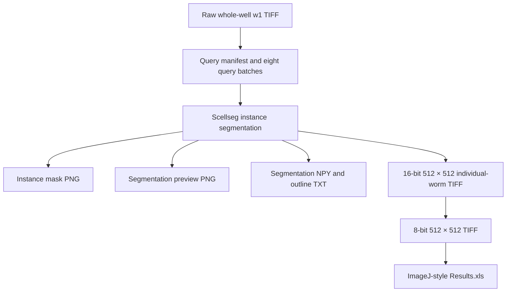
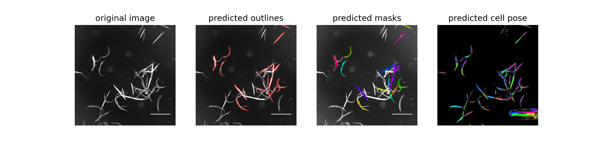
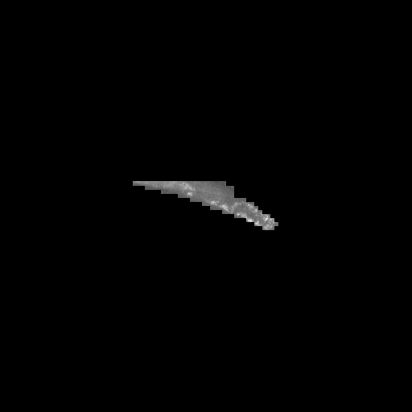

# Scellseg single-worm analysis workflow

## Purpose and scope

This workflow describes the conversion of whole-well `w1` fluorescence images
into segmented worm instances, individual-worm crops, and ImageJ-style
measurement tables. It is limited to the screening-image work package;
presentation composites and statistical plotting files are not inputs.

The archived directory layout establishes the processing stages and output
counts. It does not establish the exact project model weights, segmentation
parameters, manual corrections, 8-bit conversion rule, or ImageJ macro. These
items remain explicit unknowns.

## Analytical role

The plate acquisitions contain two reporter channels, but the verified
Scellseg query and instance directories use `w1` only. In the image archive,
`w1` is assigned to FITC/GFP and `w2` to DAPI/Violet. Segmentation therefore
defines worm instances from `w1`; the available instance outputs alone cannot
reconstruct a paired `YFP500/YFP420` measurement.

## Inputs

| Input | Observed specification |
|---|---|
| Query images | 702 TIFF files across eight batches |
| Channel | `w1`, FITC/GFP |
| Image size | 2007 × 2007 pixels |
| Bit depth | 16-bit |
| Naming | `*_w1_img.tif` |
| Metadata source | [`metadata/metadata.xlsx`](metadata/ROS_metadata.xlsx), `images` sheet |

The query directories appear to contain processing copies of raw `w1` files.
One checked pair was byte-identical, but all pairs should be checksum-verified
before deduplication.

## Workflow overview



## Processing stages

### 1. Query preparation

Select `w1` TIFF rows from the filename channel token that belong to a raw-data
path, are not already inside the single-worm tree, and contain plate and well
identifiers. Preserve plate assignment in `query-1` through `query-8`.

The packaged preparation script defaults to `manifest` mode, which records the
mapping without copying data. `copy` and `symlink` modes are available when a
separate processing tree is required.

### 2. Instance segmentation

Scellseg creates a labelled mask and preview for each query image. The observed
file conventions are:

| Artifact | Files | Observed role |
|---|---:|---|
| `*_cp_masks.png` | 702 | 2007 × 2007 instance-mask image |
| `*_cp_output.png` | 702 | 3600 × 900 segmentation preview |
| `*_seg.npy` | 702 | segmentation array |
| `*_cp_outlines.txt` | 702 | instance outlines |

The project model weights are currently missing and need to be obtained from
the algorithm owner. The upstream documentation's generic weights and default
thresholds must not be presented as the settings used for these images.

### Representative segmentation output

The following archived preview shows one representative whole-well result.
From left to right, the panels contain the input fluorescence image, predicted
instance outlines, colour-coded predicted masks, and the predicted cell-pose
field. The preview is displayed as supplied and is not a newly generated
analysis result.



The corresponding processing tree also contains one TIFF crop for each
retained instance. The example below is an 8-bit display derivative for one
predicted worm. It was converted from the archived TIFF to PNG only for browser
display; the spatial content was not altered.



### 3. Individual-worm extraction

The eight `single-*` directories contain 4,878 instance-labelled, 16-bit TIFF
files at 512 × 512 pixels. No confirmed command describes crop centring,
padding, edge handling, or instance exclusion. Preserve these files as the
intensity-retaining derivative.

### 4. 8-bit conversion and measurement

The eight `output-*` directories contain 4,878 corresponding 8-bit TIFF files
at 512 × 512 pixels. A sampled `single`/`output` pair was not byte-identical.
Each output directory also contains a tab-delimited text file named
`Results.xls`, with fields including `Area`, `Mean`, `Min`, `Max`, `IntDen`,
`RawIntDen`, `MinThr`, and `MaxThr`.

The ImageJ version, macro, threshold settings, and 16-to-8-bit conversion rule
must be recovered before quantitative measurements are exactly reproducible.

## Packaged software

The `scellseg_analysis/` directory contains:

- Scellseg source code, GUI assets, examples, and upstream licence files;
- the exact upstream source revision recorded in `SOURCE_VERSION.txt`;
- a configuration template that retains unknown values as `null`;
- scripts for query-manifest generation, GUI launch, and output auditing; and
- Conda and pip environment definitions.

The abbreviated commit `84fe158…` is a Git source-version identifier. It makes
the packaged source snapshot unambiguous if the online repository later
changes; it is not evidence that the same revision was used in the original
analysis. Model-weight binaries are not included and are marked as pending.

## Setup

```bash
cd scellseg_analysis
conda env create -f environment.yml
conda activate celegans-scellseg
```

The environment follows the upstream Python 3.7.4 reference line. GPU and CUDA
versions should be adapted to the execution host; they are unknown for the
original run.

## Commands

Create and inspect a query mapping without copying images:

```bash
python scripts/prepare_query_inputs.py \
  --metadata ../metadata/metadata.xlsx \
  --dataset-root /path/to/C_elegans_ROS_Dataset \
  --output-root /path/to/scellseg_work \
  --mode manifest
```

After reviewing the manifest, use `copy` or `symlink` mode if the query tree
should be materialized. Existing destinations are not replaced unless
`--overwrite` is supplied.

After the confirmed model weights and parameters are added, launch the GUI:

```bash
bash scripts/run_scellseg_gui.sh
```

Running with an arbitrary upstream model is a new analysis, not a reproduction
of the archived output.

Audit an existing processing tree:

```bash
python scripts/audit_scellseg_outputs.py \
  --root /path/to/single_worm_data_7.8 \
  --json-out scellseg_output_audit.json
```

## Expected output inventory

| Processing image group | Images |
|---|---:|
| Query TIFF inputs | 702 |
| Mask PNGs | 702 |
| Preview PNGs | 702 |
| `single-*` 16-bit TIFFs | 4,878 |
| `output-*` 8-bit TIFFs | 4,878 |
| **TIFF and PNG total** | **11,862** |

The supplied descriptive count is 4,886 isolated worms, while both instance
directories contain 4,878 TIFFs. The eight-instance difference must be resolved
against the original processing log; the audit script reports filesystem
counts without silently correcting them.

## Quality control

- Review masks and previews for merged worms, fragments, debris, empty
  instances, and edge truncation.
- Retain the link from plate and well to query image, mask, preview, and
  numbered instance crop.
- Verify query/raw pairs by checksum before eliminating processing copies.
- Keep 16-bit and 8-bit derivatives as distinct processing stages.
- Do not infer `w2` measurements or a paired-channel ratio from `w1`-only
  instance images.
- Record exclusions and manual corrections at instance level.

## Reproducibility gaps

Exact end-to-end reproduction still requires:

- the project model weights and whether they were pretrained or fine-tuned;
- the Scellseg version actually used;
- cell diameter, model-match threshold, cell-probability threshold, channel
  settings, device, and batch parameters;
- fine-tuning images, masks, data split, and training settings, if applicable;
- crop-generation and instance-exclusion rules;
- the 8-bit conversion rule; and
- the ImageJ version, macro, thresholds, measurements, and QC rules.

These unknowns are represented as `null` or `unknown` in
`configs/scellseg_workflow_config.yaml` so later confirmations can be added
without rewriting the workflow.

## Citation and licence

Use of software-derived images should cite both the dataset and Scellseg:

> Xun D, Chen D, Zhou Y, Lauschke VM, Wang R, Wang Y. Scellseg: a style-aware
> deep learning tool for adaptive cell instance segmentation by contrastive
> fine-tuning. *iScience*. 2022;25:105506.
> https://doi.org/10.1016/j.isci.2022.105506

See `scellseg_analysis/THIRD_PARTY_NOTICES.md` and the upstream licence files
before redistribution.
