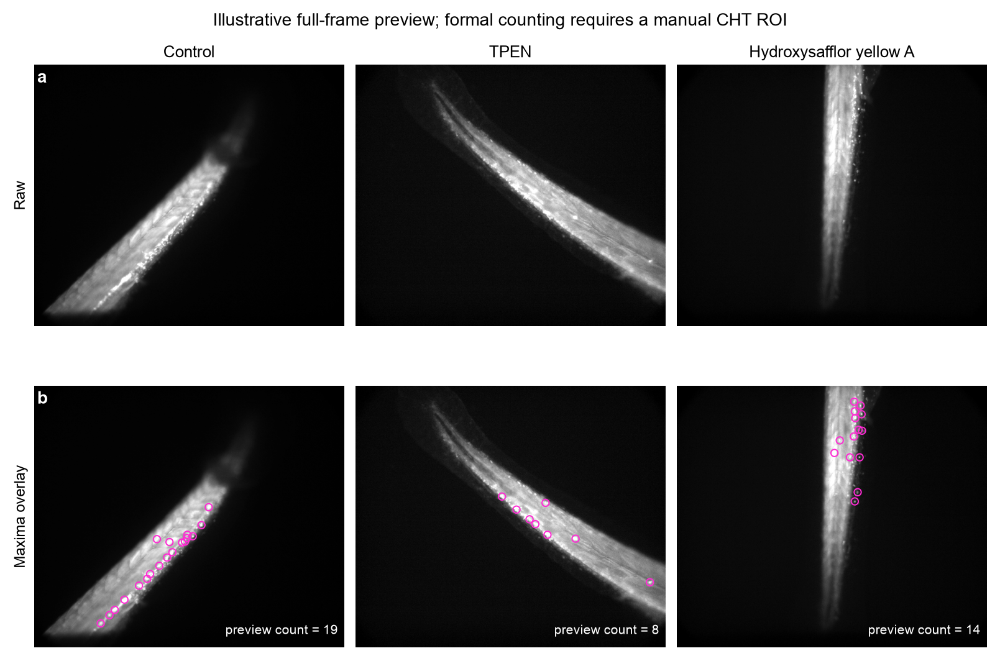
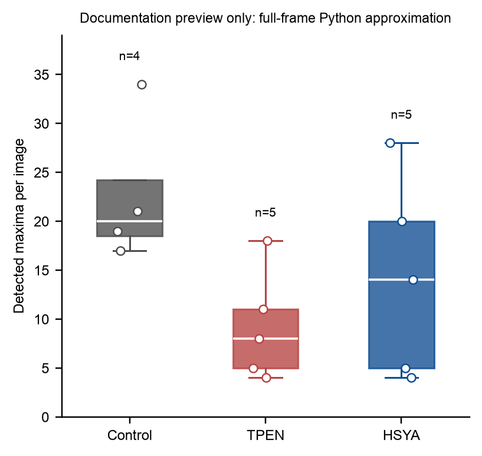
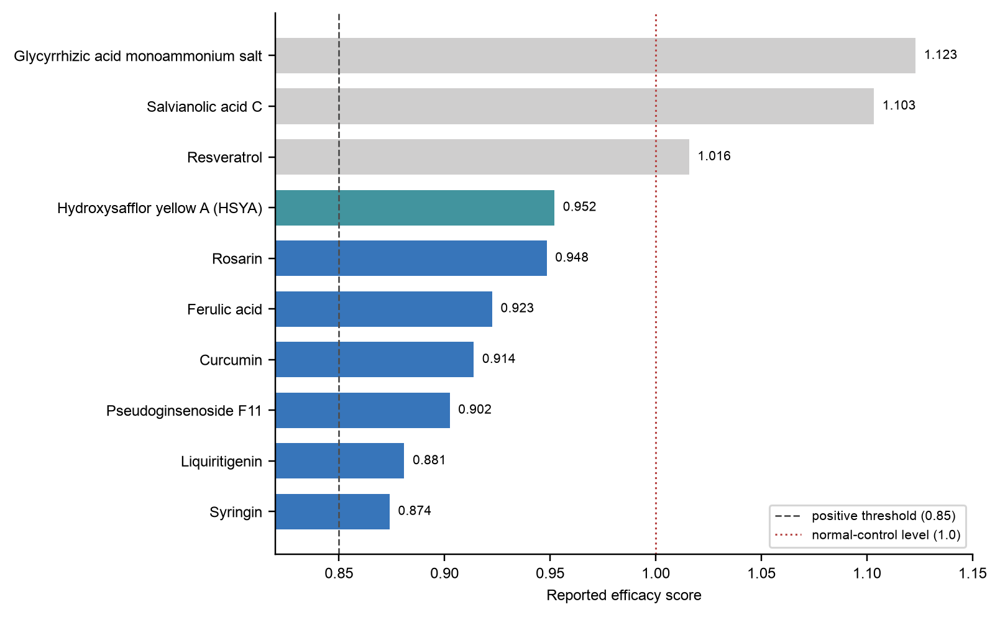

# TPEN Zebrafish HSC-Counting Workflow

This workflow reconstructs the zebrafish drug-screening quantification described by Chen et al. It focuses only on fluorescence images from the phenotypic screen; mouse, cell-culture, western-blot, Excel, Prism, and other processing files are outside scope.

## Biological question

Which treatments restore `runx1:eGFP`-positive HSC signals in the caudal hematopoietic tissue (CHT) of TPEN-treated zebrafish embryos without increasing the mean HSC count above the normal-control level?

## Article-derived experimental design

| Item | Reported condition |
|---|---|
| Zebrafish line | `Tg(runx1:eGFP)` |
| Treatment start | 2.5 dpf |
| TPEN model | 150 uM TPEN |
| Screening compound | 100 uM, added simultaneously with TPEN |
| Positive rescue control | 100 uM ZnSO4 |
| Vehicle control | 0.1% DMSO |
| Biological replicates | 5–8 embryos per group |
| Imaging time | 12 h after treatment |
| Microscope | Leica DMI 3000B inverted microscope system |
| Quantification software | ImageJ 1.53c |
| Primary readout | Count of HSC fluorescence maxima in the CHT |

The paper describes a regional cell-signal count, not mean fluorescence intensity. The analyst first restricts the measurement to the CHT and then counts local fluorescence maxima as HSC signals.

## Analysis logic

```mermaid
flowchart LR
    A["Select one TIFF per embryo"] --> B["Assign treatment and biological replicate"]
    B --> C["Draw the CHT ROI"]
    C --> D["Convolve in ImageJ"]
    D --> E["Find Maxima: noise tolerance 30"]
    E --> F["Review overlay and record HSC count"]
    F --> G["Aggregate biological replicates"]
    G --> H["Calculate efficacy score"]
    H --> I["Apply >0.85 and above-normal filters"]
```



## Formal ImageJ/Fiji method

Use the macro in `tools/tpen_hsc_counting/macros/TPEN_HSC_Count_Current_Image.ijm`.

1. Select a single grayscale TIFF representation for each embryo. Do not count both an SIF source image and a TIFF export as separate replicates.
2. Open the image in Fiji/ImageJ.
3. Draw a polygon or freehand ROI around the CHT. The images vary in orientation, so a single fixed rectangle is not appropriate.
4. Save the ROI with a filename traceable to the image.
5. Convert the working duplicate to 8-bit if required by the established laboratory protocol.
6. Run `Process > Filters > Convolve`.
7. Run `Process > Find Maxima`, set noise tolerance to `30`, and return a point selection.
8. Count the points within the CHT ROI.
9. Save a maxima overlay for QC.
10. Append the per-embryo result to a CSV table.

The article does not report the CHT ROI geometry or the Convolve kernel. The included macro uses a visible, editable 3 x 3 normalized mean kernel as a provisional default. Both the kernel and the anatomical ROI convention must be confirmed with the laboratory before the output is described as an exact reproduction.

## Required per-embryo output

| Field | Meaning |
|---|---|
| `image_name` | Source TIFF filename |
| `relative_path` | Dataset-relative image path |
| `treatment_name` | Normalized English treatment name |
| `biological_replicate_id` | Final filename suffix; for example, `47-1` is compound 47, biological replicate 1 |
| `roi_file` | Saved CHT ROI path |
| `noise_tolerance` | `30` for the article-derived workflow |
| `convolve_kernel` | Exact kernel used |
| `hsc_count` | Number of detected and QC-approved maxima in the CHT |
| `qc_status` | Pass, review, or exclude |
| `exclusion_reason` | Blank unless the image is excluded |

## Efficacy calculation

For each treatment, calculate the mean across biological embryos:

```text
efficacy score = (N_drug - N_model) / (N_control - N_model)
```

- `N_drug`: mean HSC count in the TPEN plus compound group.
- `N_model`: mean HSC count in the TPEN-only group.
- `N_control`: mean HSC count in the normal control group.

The reported positive threshold is greater than `0.85`. A treatment mean above the normal control corresponds to a score greater than `1` and is flagged for exclusion from hit selection. The zinc group is a positive rescue control, not a library hit.

## Demonstration images

The display plate uses a matched batch of real Control, TPEN, and HSYA TIFF images. Within each group, the displayed image was selected by a predeclared rule: the image whose preview count was closest to the group median. No local retouching was applied. Because pixel calibration was unavailable, no scale bar was inferred.



The magenta circles are produced by the Python preview detector. They illustrate the expected maxima output but do not replace manual CHT delineation and ImageJ execution.

## Demonstration statistics



| Group | n | Mean | SD | Median | Q1–Q3 |
|---|---:|---:|---:|---:|---:|
| Control | 4 | 22.75 | 7.68 | 20 | 18.5–24.25 |
| TPEN | 5 | 9.20 | 5.63 | 8 | 5–11 |
| HSYA | 5 | 14.20 | 10.16 | 14 | 5–20 |

These are full-frame Python approximation results from 14 documentation images. They are useful for software and figure inspection only. No hypothesis test is reported, and the preview efficacy score for HSYA (`0.369`) is not a paper result or a valid substitute for manual-CHT ImageJ counting.

## Reported screening-score reference



The supplied compound-reference workbook contains ten scores above `0.85`. Seven fall between `0.85` and `1.0`; three exceed the normal-control level and are retained in the reference table but marked as excluded. HSYA has a supplied score of `0.952`. Figure source values are available in `tools/tpen_hsc_counting/figures/source_data/screening_score_reference.csv`.

## QC criteria

Review every overlay and flag:

- maxima outside the anatomical CHT;
- peaks created by tissue edges or saturated structures;
- merged adjacent cells represented by one maximum;
- one cell represented by multiple maxima;
- dim but visually credible HSC signals missed by the fixed tolerance;
- clipped, out-of-focus, or incomplete CHT regions;
- duplicate SIF/TIFF representations of the same embryo.

Any change to the ROI convention, convolution kernel, bit-depth conversion, or noise tolerance should create a new method version and trigger reprocessing of all compared groups.

## Toolkit outputs

```text
results/
├── per_embryo_hsc_counts.csv
├── group_summary.csv
├── efficacy_scores.csv
├── rois/
├── qc_overlays/
└── analysis_environment.txt
```

The complete toolkit, commands, configuration, reference CSVs, figures, and QA notes are distributed separately as `TPEN_HSC_Counting_Toolkit.zip`. In the combined source tree, the same files are located in `tools/tpen_hsc_counting/`.
