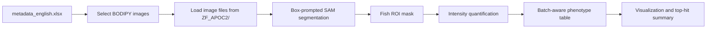
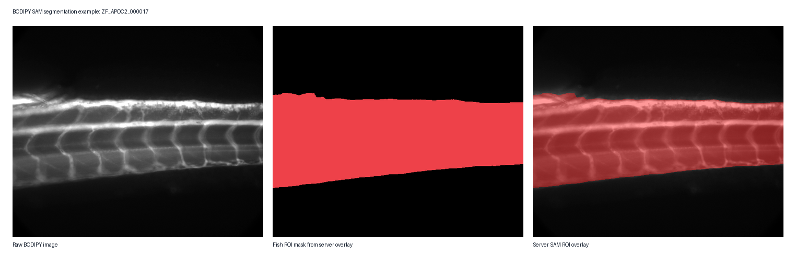
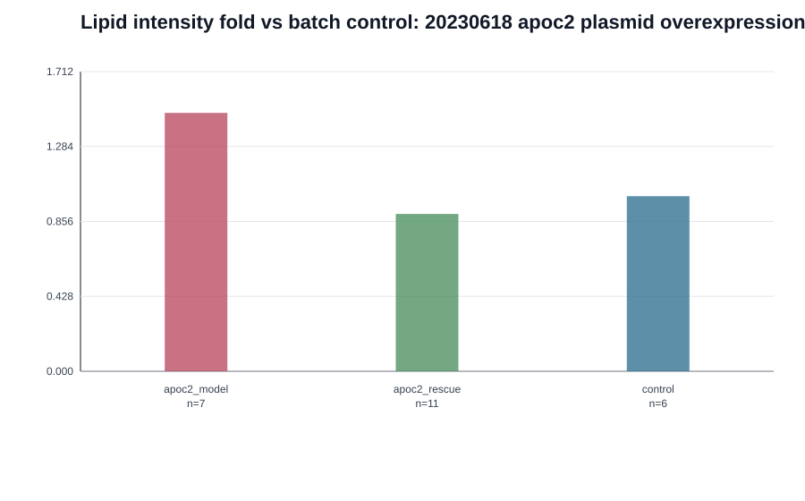
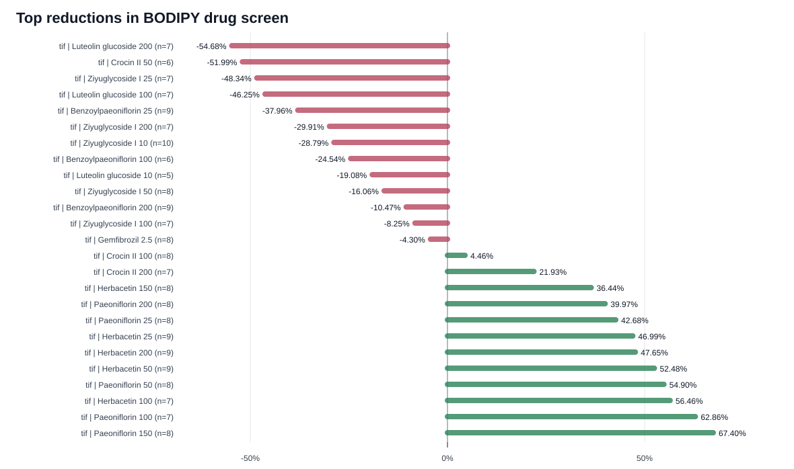

# BODIPY SAM Intensity Workflow

This workflow describes an example image-analysis case for the ZF_APOC2
dataset. It uses BODIPY-stained zebrafish images to quantify lipid-associated
fluorescence intensity after segmenting the fish body region with a
box-prompted Segment Anything Model (SAM).

The workflow is intended as a reproducible analysis example for model
validation and drug-screening images. It follows the same general logic as a
Cell Painting Gallery workflow page: define input data, run a segmentation and
feature-extraction pipeline, generate quality-control overlays, summarize the
phenotype table, and produce analysis-ready visualizations.

## Biological Question

The associated article uses BODIPY 505/515 staining to measure neutral lipid
accumulation in zebrafish larvae. In the `apoc2`-deficient model, stronger
BODIPY fluorescence in the caudal vessel region indicates lipid accumulation.
Candidate compounds are evaluated by whether they reduce the BODIPY signal
within the relevant zebrafish region compared with the batch-matched model
control.

## Input Data

Dataset root:

```text
ZF_APOC2/
```

Main input folders:

```text
ZF_APOC2/model/bodipy/
ZF_APOC2/drug_screen/
```

Metadata file:

```text
metadata/metadata.xlsx
```

The metadata file contains one row per image and includes the English
dataset-relative `relative_path` used to locate each image under `ZF_APOC2/`.

## Method Summary

1. Select BODIPY images from the metadata table.
2. Load the selected image and prepare it for SAM input.
3. Segment the zebrafish body region using a box-prompted pretrained SAM model.
4. Save the binary mask and an image-mask overlay.
5. Quantify BODIPY fluorescence intensity inside the selected mask.
6. Summarize intensity values by experimental batch and treatment group.
7. Normalize comparisons within each batch to reduce exposure-time bias.
8. Generate plots and hit-ranking tables for model validation or drug screening.

## Workflow Diagram



## Segmentation

The segmentation step uses a pretrained SAM checkpoint. For each selected image,
the pipeline supplies a broad box prompt that covers the expected zebrafish body
region. SAM proposes a mask, and the workflow keeps the mask used for downstream
intensity quantification.

Outputs:

- binary fish-region mask
- overlay image for visual inspection
- per-image segmentation status



## Intensity Quantification

For each image, BODIPY signal is quantified inside the selected fish-region
mask. The primary output is integrated fluorescence intensity, computed as the
sum of image pixel intensities within the segmented mask.

Primary per-image measurements:

| Field | Meaning |
|---|---|
| `image_id` | Stable image identifier |
| `relative_path` | Dataset-relative English image path |
| `mask_area_px` | Number of pixels in the selected mask |
| `integrated_intensity` | Sum of pixel intensities inside the mask |
| `mean_intensity` | Mean pixel intensity inside the mask |
| `batch` | Experiment batch inferred from the dataset path |
| `group` | Genotype, control, or treatment group inferred from filename/path |


## Batch-Aware Summarization

Because images from different experiments may have different exposure settings,
the workflow compares intensity values within the same experimental batch. For
model-validation experiments, groups are summarized within each batch or
developmental stage. For drug-screening experiments, each treatment group is
compared with the matched model-control group from the same batch.

Recommended summary outputs:

- per-image phenotype table
- group-level summary table
- batch-normalized intensity table
- top-hit table for drug-screening batches





## Example Commands

Model-validation workflow:

```bash
python scripts/select_bodipy_images.py --config configs/bodipy_sam_box_full_config.yaml
python scripts/run_sam_segmentation.py --config configs/bodipy_sam_box_full_config.yaml
python scripts/quantify_bodipy_masks.py --config configs/bodipy_sam_box_full_config.yaml
python scripts/summarize_bodipy_phenotypes.py --config configs/bodipy_sam_box_full_config.yaml
python scripts/test_bodipy_significance.py --config configs/bodipy_sam_box_full_config.yaml
python scripts/visualize_bodipy_results.py --config configs/bodipy_sam_box_full_config.yaml
```

Drug-screening workflow:

```bash
python scripts/select_bodipy_images.py --config configs/bodipy_sam_drug_screen_config.yaml
python scripts/run_sam_segmentation.py --config configs/bodipy_sam_drug_screen_config.yaml
python scripts/quantify_bodipy_masks.py --config configs/bodipy_sam_drug_screen_config.yaml
python scripts/summarize_drug_screen.py --config configs/bodipy_sam_drug_screen_config.yaml
python scripts/visualize_drug_screen_results.py --config configs/bodipy_sam_drug_screen_config.yaml
```

## Expected Outputs

```text
analysis/
├── selected_images.csv
├── masks/
├── qc_overlay/
├── per_image_intensity.csv
├── group_summary.csv
├── significance_tests.csv
├── figures/
└── report.html
```